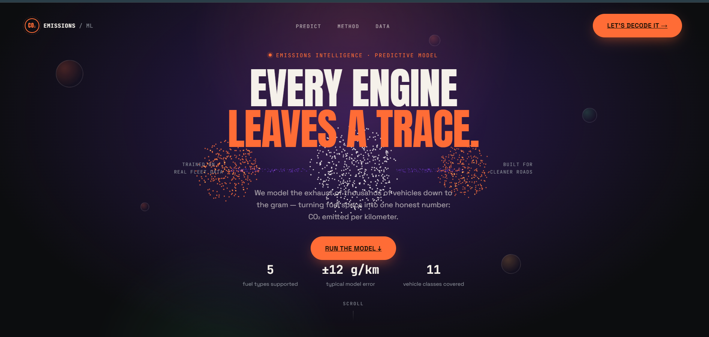
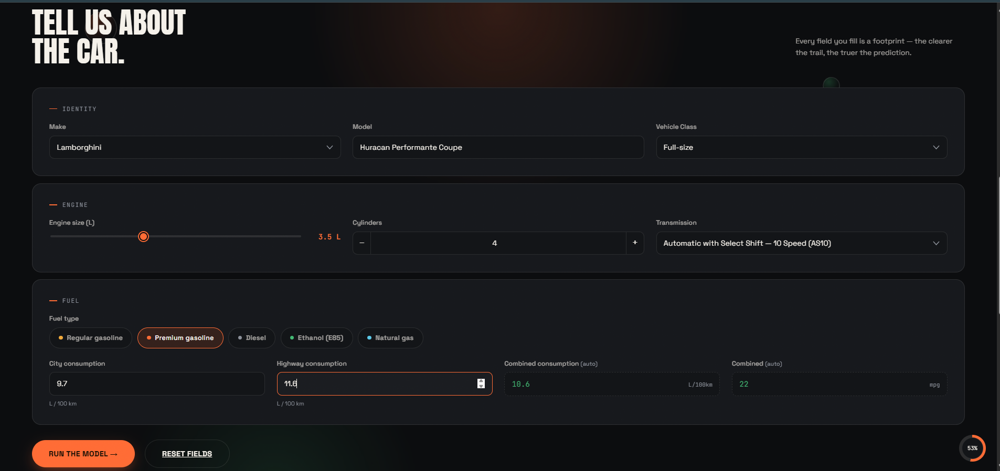
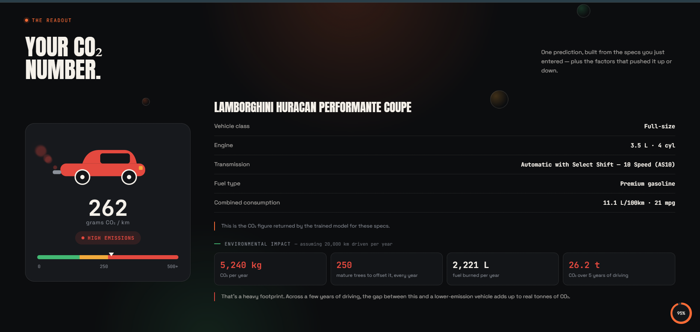

# 🚗 CO₂ Emissions Predictor

<p align="center">
  
  
  
  
  
</p>

<p align="center">
  An end-to-end machine learning application that predicts vehicle <strong>CO₂ emissions</strong> from engine specifications, fuel consumption, and other technical characteristics — from raw data to a deployed, interactive web app.
</p>

<p align="center">
  <a href="#-live-demo">Live Demo</a> •
  <a href="#-screenshots">Screenshots</a> •
  <a href="#-installation">Installation</a> •
  <a href="#-usage">Usage</a>
</p>

---

## 🔗 Live Demo

> **[https://co2autosense.onrender.com](https://co2autosense.onrender.com)**

---

## 🖼️ Screenshots


### Home

<p align="center">
  
</p>

---

### Prediction Form

<p align="center">
  
</p>

---

### Result

<p align="center">
  
</p>

## 📑 Table of Contents

- [Overview](#-project-overview)
- [Features](#-features)
- [Dataset](#-dataset)
- [Tech Stack](#-tech-stack)
- [ML Workflow](#-machine-learning-workflow)
- [Model Evaluation](#-model-evaluation)
- [Performance Summary](#-performance-summary)
- [Project Structure](#-project-structure)
- [Installation](#-installation)
- [Usage](#-usage)
- [Deployment](#-deployment)
- [What I Built vs. LLM-Assisted Work](#-what-i-built-vs-llm-assisted-work)
- [Contributing](#-contributing)
- [License](#-license)
- [Support](#-support)

---

## 📌 Project Overview

Vehicle emissions are a major contributor to environmental degradation, and understanding what drives them is a key step toward greener transportation choices. This project applies supervised machine learning to estimate a vehicle's **CO₂ emissions (g/km)** from its technical specifications — engine size, cylinder count, transmission type, fuel type, and fuel consumption figures.

Beyond producing an accurate regression model, this project follows a full, realistic ML workflow end to end: structured data cleaning, exploratory analysis, pipeline-based preprocessing, hyperparameter tuning, and deployment as a usable, interactive web application.

---

## 🚀 Features

- 📊 Comprehensive Exploratory Data Analysis (EDA)
- 🧹 Robust data cleaning and preprocessing
- 🛠️ Feature engineering for numerical and categorical variables
- 🔗 Unified, pipeline-based ML workflow (scikit-learn `Pipeline`)
- 🎯 Hyperparameter tuning via `GridSearchCV`
- 📈 Rigorous model performance evaluation
- 💾 Model serialization for production use (joblib / `.pkl`)
- 🌐 Interactive web app with cascading Make → Model dropdowns and live predictions
- ☁️ Deployment-ready configuration (Procfile included)

---

## 📂 Dataset

The dataset contains vehicle records with the following attributes:

| Feature | Description |
|---|---|
| Make | Vehicle manufacturer |
| Model | Vehicle model |
| Vehicle Class | Category (e.g., SUV, Compact, Mid-size) |
| Engine Size (L) | Engine displacement in liters |
| Cylinders | Number of cylinders |
| Transmission | Transmission type |
| Fuel Type | Type of fuel used |
| Fuel Consumption (City) | City fuel consumption (L/100 km) |
| Fuel Consumption (Highway) | Highway fuel consumption (L/100 km) |
| Combined Fuel Consumption | Combined city/highway consumption |
| Combined MPG | Combined fuel efficiency (miles per gallon) |
| **CO₂ Emissions** | **Target variable (g/km)** |

---

## 🛠️ Tech Stack

**Machine Learning & Data Processing**
- Python
- Pandas · NumPy
- Matplotlib
- Scikit-learn
- Joblib

**Backend**
- Flask — serves the trained pipeline via a `/predict` endpoint

**Frontend**
- HTML / CSS / JavaScript, including a Three.js WebGL particle hero, animated SVG visualizations, and scroll-driven motion

**Deployment**
- Procfile-based deployment (Render)

---

## 📊 Machine Learning Workflow

1. **Data Collection** — Sourcing the raw vehicle emissions dataset
2. **Data Cleaning** — Handling missing values, duplicates, and inconsistencies
3. **Exploratory Data Analysis (EDA)** — Understanding feature distributions and relationships
4. **Feature Engineering** — Deriving and transforming predictive features
5. **Data Preprocessing** — Encoding categorical variables, scaling numerical ones
6. **Model Selection** — Comparing candidate regression algorithms
7. **Hyperparameter Tuning** — Optimizing model parameters with `GridSearchCV`
8. **Model Evaluation** — Validating performance on held-out data
9. **Model Serialization** — Exporting the trained pipeline (`co2_pipeline.pkl`)
10. **Web Application Deployment** — Serving live predictions through a Flask app, called directly from the frontend form via `fetch`

---

## 📈 Model Evaluation

The trained model was evaluated on a held-out test set using standard regression metrics to assess its predictive performance and generalization capability.

| Metric | Value |
|:-------|------:|
| **R² Score** | **0.9964** |
| **Mean Absolute Error (MAE)** | **2.1141 g/km** |
| **Root Mean Squared Error (RMSE)** | **3.4493 g/km** |

## 📈 Performance Summary

- **R² Score:** The model explains approximately **99.64%** of the variance in vehicle CO₂ emissions.
- **MAE:** Predictions deviate from the actual CO₂ emissions by an average of **YOUR_MAE g/km**.
- **RMSE:** The model achieves an RMSE of **3.4493 g/km**, indicating strong predictive performance while appropriately penalizing larger prediction errors.

Overall, the results demonstrate that the model generalizes well to unseen data and provides reliable CO₂ emission estimates across different vehicle configurations.

## 💻 Project Structure

```
CO2-Emissions-Prediction/
│
├── notebook/               # Jupyter notebooks (EDA, experimentation, model training)
├── static/                 # CSS, JavaScript, and static assets for the web app
├── templates/              # HTML templates rendered by Flask
├── assets/                 # Project Screenshots
├── app.py                  # Flask application entry point
├── co2.csv                 # Raw dataset
├── cleaned_co2.csv         # Cleaned/preprocessed dataset
├── co2_pipeline.pkl        # Serialized preprocessing + model pipeline
├── model_frequency.pkl     # Serialized frequency-encoding artifact
├── Procfile                # Deployment process definition
├── requirements.txt        # Python dependencies
├── .python-version         # Python version
├── .gitignore
└── README.md
```

---

## ⚙️ Installation

```bash
# Clone the repository
git clone <repository-url>
cd CO2-Emissions-Prediction

# (Recommended) Create and activate a virtual environment
python -m venv venv
source venv/bin/activate      # On Windows: venv\Scripts\activate

# Install dependencies
pip install -r requirements.txt
```

---

## ▶️ Usage

**Run the web application locally:**

```bash
python app.py
```

Then open your browser and navigate to:

```
http://127.0.0.1:5000
```

Select the vehicle's make and model (cascading dropdowns), then enter engine size, cylinders, transmission, fuel type, and fuel consumption to get a predicted CO₂ emissions value in real time, calculated by the trained model on the backend — not a client-side formula.

---

## ☁️ Deployment

This project is deployed on **[Render](https://render.com)**.

🔗 **Live app:** [https://co2autosense.onrender.com/](https://co2autosense.onrender.com/)

## 🙋 What I Built vs. LLM-Assisted Work

In the interest of being upfront about how this project was made:

- **Built independently:** the entire machine learning pipeline — data cleaning, EDA, feature engineering, preprocessing, model selection, hyperparameter tuning, evaluation, model serialization, and the Flask backend/API integration connecting the trained model to the app.
- **LLM-assisted:** the frontend — HTML, CSS, and JavaScript, including the visual design, animations (Three.js particle hero, SVG visualizations, scroll effects), and UI styling.

I'm sharing this breakdown because I think it's more useful — and more honest — than a generic acknowledgements section. The ML work is mine; the frontend polish had AI help.

---

## 🤝 Contributing

Contributions are welcome! To contribute:

1. Fork the repository
2. Create a feature branch (`git checkout -b feature/your-feature`)
3. Commit your changes (`git commit -m "Add your feature"`)
4. Push to the branch (`git push origin feature/your-feature`)
5. Open a Pull Request

---

## 📄 License

This project is licensed under the **MIT License** — see the [LICENSE](LICENSE) file for details.

---

## ⭐ Support

If you found this project useful, please consider giving it a ⭐ on GitHub — it helps others discover the project and motivates further development.
